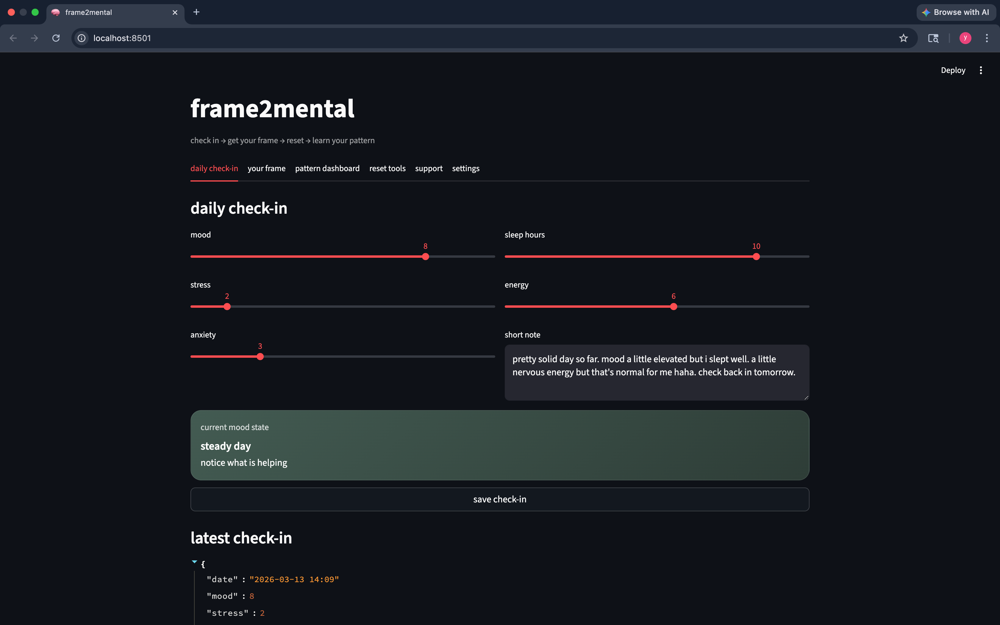
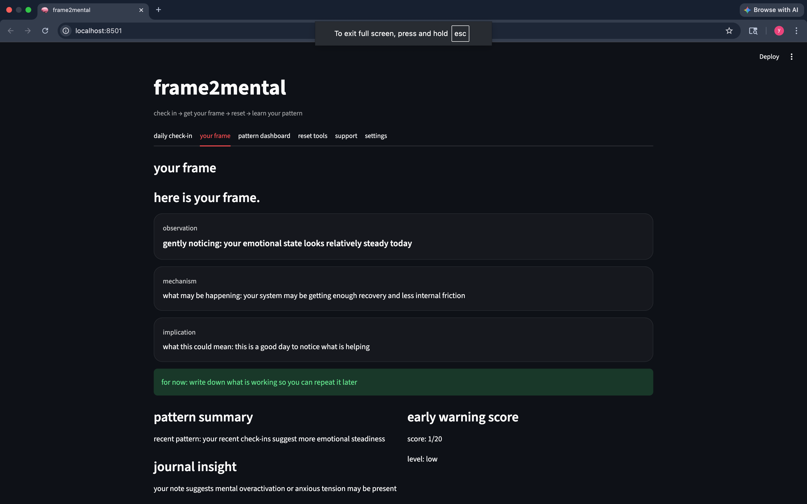
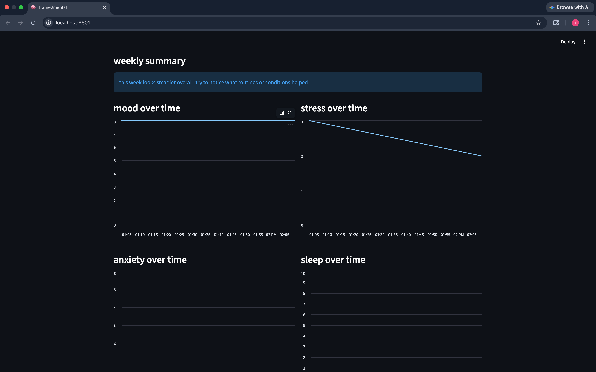
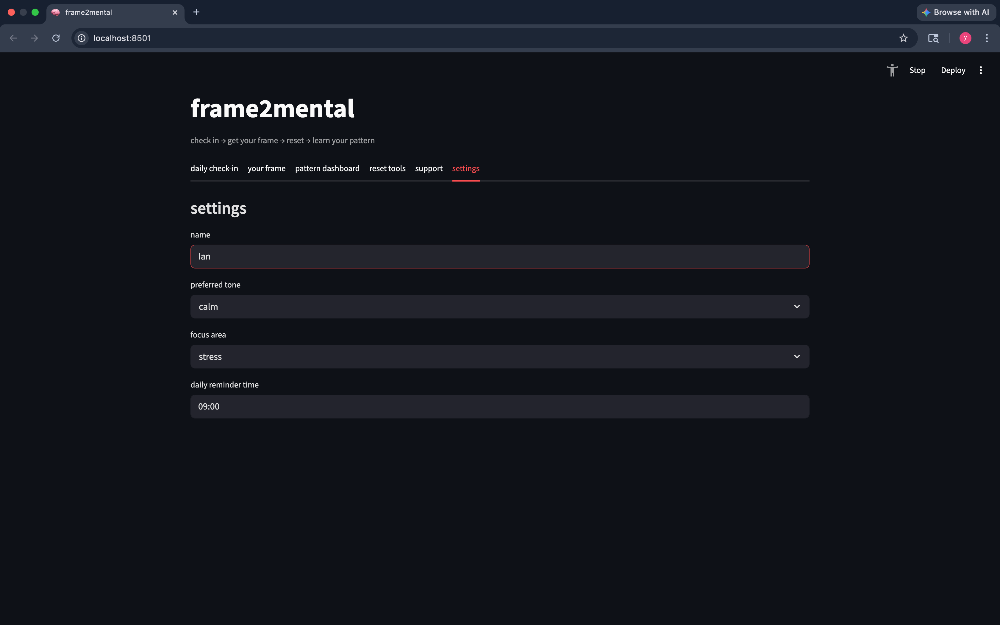

# frame²mental

frame²mental is a lightweight mental awareness app built with **Streamlit** that helps users recognize emotional patterns early and respond with clarity.

It applies the **Frame² model**:

check in → get your frame → reset → learn your pattern

Instead of reacting after emotions escalate, frame²mental helps identify the **mechanisms behind emotional patterns** sooner.

---

# Core Idea

Most mental health tools focus only on tracking mood.

frame2mental focuses on **pattern recognition and interpretation**:

- observation
- mechanism
- implication
- next step

This turns daily check-ins into **actionable insight**.

---

# Features

• daily emotional check-ins  
• frame-based insight engine  
• early warning pattern detection  
• reset plans and grounding tools  
• pattern dashboard with trend tracking  
• journal insight analysis  
• personalized tone (calm / direct / encouraging)  
• persistent user settings  
• CSV export of check-in history  

---

# Daily Check-In

Users log key signals affecting mental state:

- mood
- stress
- anxiety
- sleep
- energy
- short journal note



---

# Frame Insight

The system analyzes the check-in and generates a **Frame** explaining what may be happening.

The output always follows the structure:

- observation
- mechanism
- implication
- next step



---

# Pattern Dashboard

Over time the system visualizes emotional signals to reveal trends.

Tracked signals include:

- mood
- stress
- anxiety
- sleep
- energy

The dashboard helps users identify patterns across days and weeks.



---

# Settings

Users can personalize the experience:

- name
- preferred response tone
- focus area
- daily reminder time

Frame responses automatically adapt to the selected tone.



---

# Architecture

The project uses a modular architecture designed for clarity and expansion.

```
frame2mental
├── app.py (app launcher)
├── renderers.py (UI tabs)
├── engine
│   ├── insights.py
│   ├── warnings.py
│   └── plans.py
├── storage.py (data persistence)
├── styles.py (UI styling)
├── settings.py (user configuration)
└── data.py (tools + resources)
```

---

# Run Locally

```bash
git clone https://github.com/YOUR_USERNAME/frame2mental.git
cd frame2mental
pip install -r requirements.txt
streamlit run app.py
```

Then open:

http://localhost:8501

---

# Philosophy

frame²mental is built on a simple idea:

Emotional patterns usually appear **before emotional crises**.

By tracking small signals daily, users can recognize patterns earlier and respond with clarity instead of reaction.

---

# Roadmap

Future improvements may include:

- pattern prediction
- mobile interface
- therapist report export
- notification reminders
- AI-assisted reflections
- encrypted personal data storage

---

i will be using this every day going forward, it's like my personal therapist.

the truth lies in signal, not noise.

-ian
# License

MIT License
